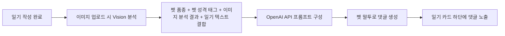
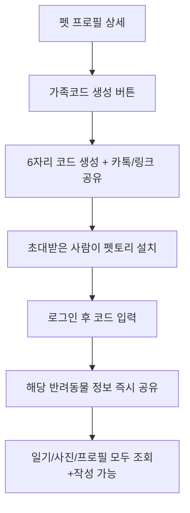

# 펫토리(Pettory) 서비스 기획서 & 화면기획서

**버전**: v3.0 (MVP 확장)
**작성 기준일**: 2026.07.07

---

## 1. 서비스 개요

### 1.1 한 줄 정의

반려동물과 나눈 오늘 하루를, 반려동물의 목소리로 되돌려받는 **AI 감성 다이어리 앱**

### 1.2 시장 내 차별점

| 구분        | 기존 반려동물 앱                | 펫토리                           |
| ----------- | ------------------------------- | -------------------------------- |
| 핵심 초점   | 건강 체크, 산책 기록, 병원 관리 | **추억 기록, 그날의 감정**       |
| 기록 방식   | 사료량/체중/접종일 등 수치 입력 | 사진 + 짧은 글로 하루 회상       |
| 상호작용    | 데이터 그래프 확인              | **AI가 펫이 되어 댓글로 대화**   |
| 감정적 가치 | 관리 도구                       | **정서적 동반자, 추억 아카이브** |

기존 앱들이 "펫을 잘 키우기 위한 관리 툴"이라면, 펫토리는 "**펫과 나눈 하루를 붙잡아두는 감성 기록 앱**"으로 포지셔닝합니다. 건강 데이터가 아니라 **감정과 순간**이 핵심 자산입니다.

### 1.3 핵심 가치 제안 (Value Proposition)

- 매일 남기는 짧은 기록이 나중엔 "**우리 아이와의 역사책**"이 된다
- 펫이 실제로 나에게 말을 거는 듯한 **정서적 몰입감**
- 가족(가족코드)과 함께 만들어가는 **공동의 추억 저장소**

---

## 2. 핵심 기능: AI 펫 댓글 시스템 (기존 MVP 핵심)

### 2.1 개념

사용자가 일기를 작성하면, OpenAI API가 아래 3가지 정보를 종합 분석하여 **펫의 성격에 맞는 말투로 댓글**을 답니다.

### 2.2 입력 데이터 구조

```
[분석 입력값]
1. 펫의 성격 태그       예) #활발 #애교 #호기심
2. 업로드 이미지 분석    예) 표정(신남/졸림/무표정), 배경 분위기(실내/야외/밝음/어두움)
3. 사용자가 작성한 일기 텍스트  예) "한강에서 1시간 산책! 새 친구도 만났다."
```

### 2.3 처리 흐름



### 2.4 출력 예시

| 성격 태그              | 상황                   | AI 댓글 예시                                                                  |
| ---------------------- | ---------------------- | ----------------------------------------------------------------------------- |
| #활발 #호기심 (강아지) | 산책 중 새 친구를 만남 | "오늘 새 친구 냄새 진짜 좋았어! 또 만나고 싶다 킁킁 🐾"                       |
| #도도 #느긋 (고양이)   | 오후 내내 낮잠         | "햇볕이 너무 따뜻해서 눈을 뜰 수가 없었어. 세상에서 제일 편안한 낮잠이었다냥" |
| #애교 (고양이)         | 주인이 늦게 귀가       | "오늘따라 왜 이렇게 늦게 왔어... 그래도 왔으니까 용서해줄게, 안아달라냥!"     |

### 2.5 UI/UX 고려사항

- 댓글은 **말풍선 + 발바닥 아이콘**으로 시각적으로 "이건 AI가 아니라 우리 아이가 말하는 것"이라는 느낌을 강화 (기존 다이어리 화면의 하이라이트 박스 UI를 그대로 활용하면 좋음)
- 댓글 생성 중에는 로딩 문구도 감성적으로: `"몽이가 일기를 읽고 있어요..."` (일반적인 "로딩 중..." 대신)
- 댓글은 **수정 불가, 재생성(다시 듣기)은 1일 1회 제한** → AI 호출 비용 관리 + "그날의 반응"이라는 희소성 유지

---

## 3. 신규 기능 명세

아래 8개 기능은 우선순위/개발 난이도를 고려해 **Phase로 구분**하는 것을 추천합니다.

| Phase                     | 포함 기능                                                    | 이유                                            |
| ------------------------- | ------------------------------------------------------------ | ----------------------------------------------- |
| **Phase 1 (필수 MVP)**    | 6. 스플래시/온보딩, 7. 회원가입·소셜로그인, 1. 가족코드 공유 | 서비스 진입/기본 골격 없이는 출시 불가          |
| **Phase 2 (핵심 차별화)** | 2. 가족 반응 기능, 4. SNS 공유 카드, 3. 추억 리마인드        | 바이럴 + 리텐션 직결                            |
| **Phase 3 (고도화)**      | 5. 추억북, 8. 주간/월간 AI 요약                              | 데이터가 어느 정도 쌓인 후에 가치가 생기는 기능 |

---

### 3.1 [Phase 1] 스플래시 화면 & 온보딩 (기능 6)

**목적**: 첫인상에서 앱의 감성적 톤을 각인시키고, 핵심 차별점(건강관리 X, 추억기록 O)을 3컷 안에 전달

**구성**

1. **스플래시**: 로고 + 발바닥 애니메이션 (1.5초 노출 후 자동 전환)
2. **온보딩 스와이프 (3컷)**
   - 1컷: "매일의 순간을, 잊지 마세요" — 사진+일기 작성 화면 예시
   - 2컷: "우리 아이가 답장을 보내요" — AI 댓글 달리는 모습 (핵심 차별점 강조)
   - 3컷: "가족과 함께 채워가는 추억" — 가족코드 공유 화면 예시
3. 마지막 컷에 "시작하기" CTA 버튼, 상단에 "건너뛰기" 텍스트 링크

**화면 기획**

```
┌─────────────────────────┐
│  ○ ● ●          [건너뛰기] │  ← 인디케이터 + 스킵
│                          │
│      [일러스트/스크린샷]   │
│                          │
│   우리 아이가 답장을      │
│      보내요 🐾           │
│                          │
│  일기를 쓰면, 몽이만의     │
│  말투로 답장이 와요        │
│                          │
│     [다음 >]              │
└─────────────────────────┘
```

---

### 3.2 [Phase 1] 회원가입 / 소셜로그인 (기능 7)

**구성 요소**

- 소셜 로그인: 카카오(1순위), 애플(iOS 필수), 구글
- 카카오 우선 배치 이유: 국내 반려동물 커뮤니티 사용자층과의 접점이 큼, 가족코드 공유 시 카카오톡 공유 연동과 자연스럽게 이어짐
- 애플 로그인은 App Store 심사 정책상 소셜 로그인 제공 시 **필수 포함**

**화면 기획**

```
┌─────────────────────────┐
│                          │
│      [펫토리 로고]         │
│  "오늘의 우리, 기록해요"    │
│                          │
│  ┌────────────────────┐ │
│  │ 🟡  카카오로 시작하기  │ │
│  └────────────────────┘ │
│  ┌────────────────────┐ │
│  │ 🍎  Apple로 시작하기  │ │
│  └────────────────────┘ │
│  ┌────────────────────┐ │
│  │ 🔵  Google로 시작하기 │ │
│  └────────────────────┘ │
│                          │
│   이메일로 계속하기 (텍스트)│
└─────────────────────────┘
```

**분기 처리**

- 최초 로그인 시 → 반려동물 등록 화면(기존 화면)으로 자연 연결
- 기존 유저 로그인 시 → 홈 화면으로 바로 진입
- **가족코드로 초대받아 들어온 경우** → 로그인 후 "코드 입력" 화면을 자동으로 띄움 (3.3 참고)

---

### 3.3 [Phase 1] 가족코드 공유 기능 (기능 1)

**목적**: 배우자, 가족 등 여러 명이 같은 반려동물의 기록을 함께 보고 쓸 수 있도록 함

**핵심 플로우**



**권한 설계 (중요)**

- 코드를 발급한 사람 = **오너(주 보호자)**: 가족코드 재발급/삭제, 펫 프로필 삭제 권한 보유
- 코드로 참여한 사람 = **가족 구성원**: 일기 작성/조회, 사진 업로드, 댓글/반응 가능하나 **펫 삭제는 불가**

**화면 기획 - 가족코드 발급**

```
┌─────────────────────────┐
│  < 몽이 - 가족 초대        │
│                          │
│   현재 함께하는 가족 (2)   │
│   👤 나 (오너)             │
│   👤 김민수                │
│                          │
│  ┌────────────────────┐ │
│  │   초대코드            │ │
│  │   A3F9K2   [복사]     │ │
│  └────────────────────┘ │
│                          │
│  [카카오톡으로 초대하기]     │
│  [링크 복사하기]           │
└─────────────────────────┘
```

**화면 기획 - 코드 입력**

```
┌─────────────────────────┐
│      가족코드 입력          │
│                          │
│  초대받은 코드를 입력해주세요│
│  ┌──┬──┬──┬──┬──┬──┐    │
│  │  │  │  │  │  │  │    │
│  └──┴──┴──┴──┴──┴──┘    │
│                          │
│       [확인]               │
│                          │
│   나중에 하기 (텍스트 링크)  │
└─────────────────────────┘
```

---

### 3.4 [Phase 2] 가족 반응 기능 (기능 2)

**목적**: 가족코드로 연결된 구성원들끼리 서로의 기록에 정서적으로 반응하며 "함께 키운다"는 느낌 강화

**기능 상세**

- 일기/사진에 **이모지 반응** (하트, 웃음, 놀람 등 4~5종으로 제한 → 커뮤니티 앱처럼 과해지지 않게)
- 짧은 댓글 작성 가능 (AI 댓글과 시각적으로 구분되도록 디자인 — 예: 가족 댓글은 일반 말풍선, AI 댓글은 발바닥 말풍선)
- 새 반응/댓글 발생 시 **푸시 알림** ("김민수님이 몽이의 오늘 일기에 반응을 남겼어요")

**화면 기획 (다이어리 상세 화면 하단 확장)**

```
┌─────────────────────────┐
│  2026.07.06   몽이         │
│  한강에서 1시간 산책!        │
│  [사진]                   │
│                          │
│  🐾 "오늘 새 친구 냄새       │
│     진짜 좋았어!" (AI)      │
│                          │
│  ────────────────────    │
│  ❤️ 😆 😮 🥹  [반응 추가]  │
│                          │
│  👤 김민수: 진짜 신났나보다ㅋㅋ│
│  [댓글 입력...]            │
└─────────────────────────┘
```

---

### 3.5 [Phase 2] SNS/카카오톡 공유 카드 (기능 4)

**목적**: 바이럴 확산 + 앱 밖에서도 "예쁜 결과물"을 남기고 싶은 욕구 충족

**공유 카드 구성 요소**

- 업로드한 사진 (배경)
- 하단에 반투명 오버레이로 날짜 + 펫 이름
- 일기 요약 1줄 (전체 텍스트가 길면 AI가 요약)
- AI 댓글 1줄 (말풍선 스타일로 삽입)
- 하단에 작게 "Pettory" 워터마크/로고 → 자연스러운 앱 홍보

**화면 기획 - 공유 미리보기**

```
┌─────────────────────────┐
│   [공유 카드 미리보기]      │
│  ┌────────────────────┐ │
│  │   [업로드한 사진]      │ │
│  │                     │ │
│  │  🐾"오늘 새 친구 냄새   │ │
│  │   진짜 좋았어!"        │ │
│  │                     │ │
│  │  2026.07.06 · 몽이    │ │
│  │           🐾 Pettory │ │
│  └────────────────────┘ │
│                          │
│  [카카오톡]  [인스타 스토리] │
│  [이미지 저장]              │
└─────────────────────────┘
```

**UX 포인트**

- 공유 카드는 정사각형(인스타)과 세로형(카톡/스토리) 2가지 비율 자동 생성
- 저장 시 이미지 해상도는 SNS 업로드 기준 최적화 (1080x1080 등)

---

### 3.6 [Phase 2] 추억 리마인드 (기능 3)

**목적**: 과거 기록을 다시 꺼내보게 해서 **재방문(리텐션)**을 유도

**트리거 조건**

- "N년 전 오늘" — 정확히 1년, 2년 전 같은 날짜에 작성한 일기가 있을 경우
- "작년 생일날" — 등록된 펫 생일과 매칭
- "함께한 지 O일" 마일스톤 — 100일, 365일, 500일 등 특정 숫자에 도달 시

**노출 위치**

- 홈 화면 상단에 카드 형태로 노출 (오늘의 카드 만들기 위 또는 아래)
- 푸시 알림으로도 발송: `"1년 전 오늘, 몽이는 이런 하루를 보냈어요 🐾"`

**화면 기획 (홈 화면 삽입)**

```
┌─────────────────────────┐
│  안녕, 보호자님 👋           │
│  [펫 아바타 목록]            │
│                          │
│  ✨ 1년 전 오늘             │
│  ┌────────────────────┐ │
│  │ [작년 사진 썸네일]      │ │
│  │ "한강에서 처음 만난 날"  │ │
│  └────────────────────┘ │
│                          │
│  오늘의 한 컷               │
│  [+ 카드 만들기]            │
└─────────────────────────┘
```

---

### 3.7 [Phase 3] 추억북 (기능 5)

**목적**: 일정 기간이 쌓이면 AI가 자동으로 "그동안의 이야기"를 정리해주는 결과물 제공 → 앱의 최종 만족감을 극대화하는 킬러 기능

**생성 주기**: 1개월 / 3개월 / 6개월 / 1년 단위 자동 생성 (사용자가 원할 시 수동 생성도 가능)

**추억북 구성**

1. **AI 요약 문구**: 해당 기간 펫의 상태를 종합 서술 (예: "이번 여름, 몽이는 유난히 산책을 좋아했어요. 특히 7월엔 새로운 친구를 3번이나 만났답니다.")
2. **감정 그래프/키워드**: 기간 동안 일기에서 자주 등장한 감정 키워드 시각화 (예: #신남 12회, #낮잠 8회)
3. **사진 모아보기**: 해당 기간 업로드 사진을 그리드로 자동 배치
4. **하이라이트 일기 3~5개**: AI가 판단한 가장 인상적인 순간 자동 선별

**화면 기획 - 추억북 목록**

```
┌─────────────────────────┐
│  < 몽이의 추억북            │
│                          │
│  ┌────────────────────┐ │
│  │ [커버 이미지]          │ │
│  │ 2026년 여름 이야기      │ │
│  │ 6.1 - 6.30           │ │
│  └────────────────────┘ │
│  ┌────────────────────┐ │
│  │ [커버 이미지]          │ │
│  │ 함께한 지 1년           │ │
│  │ 2025.7 - 2026.7      │ │
│  └────────────────────┘ │
└─────────────────────────┘
```

**화면 기획 - 추억북 상세 (매거진 형태)**

```
┌─────────────────────────┐
│  < 2026년 여름 이야기       │
│                          │
│  "이번 여름, 몽이는 유난히   │
│   산책을 좋아했어요..."      │
│                          │
│  자주 등장한 순간            │
│  #신남 12  #낮잠 8  #간식 5 │
│                          │
│  [사진 그리드 3x3]          │
│                          │
│  ⭐ 하이라이트                │
│  ┌────────────────────┐ │
│  │ 7/6 한강에서 새 친구    │ │
│  └────────────────────┘ │
│                          │
│  [PDF로 저장] [공유하기]     │
└─────────────────────────┘
```

**UX 포인트**

- 추억북은 완성 시 푸시 알림으로 "짜잔! 몽이의 여름 이야기가 도착했어요" 식으로 이벤트감 부여
- 유료화 포인트로 고려 가능 (예: 월간 추억북은 무료, PDF 인쇄용 고화질 저장은 유료)

---

### 3.8 [Phase 3] 주간/월간 AI 요약 (기능 8)

**목적**: 추억북(장기)보다 짧은 주기로 "요즘 우리 아이 어때?"에 대한 스냅샷 제공

**생성 조건**

- 기본: 매주 요약
- 예외: 해당 주 일기가 2개 이하일 경우 → 자동으로 월간 요약으로 전환 (콘텐츠 부족한 요약 방지)

**노출 위치**: 펫 프로필 상세 화면 내 **"요약" 탭** 신설 (기존 갤러리/정보 탭 옆에 추가)

**요약 내용 구성**

- 이번 주(달) 한 줄 총평: "이번 주 몽이는 산책을 자주 나가서 컨디션이 좋아 보였어요"
- 감정 태그 빈도 (간단한 바 그래프)
- 사진 하이라이트 1~2장

**화면 기획 (펫 상세 화면 탭 추가)**

```
┌─────────────────────────┐
│  < 몽이                    │
│  [프로필 이미지/정보]        │
│                          │
│  갤러리 | 정보 | 요약 ✨      │
│  ───────────────────    │
│                          │
│  이번 주 몽이 이야기          │
│  "산책을 자주 나가서          │
│   컨디션이 좋아보였어요"       │
│                          │
│  감정 분포                  │
│  신남    ████████ 6      │
│  느긋    ████ 3           │
│  애교    ██ 2             │
│                          │
│  [하이라이트 사진]           │
└─────────────────────────┘
```

---

## 4. 화면 구조 전체 IA (Information Architecture)

```
스플래시
 └─ 온보딩(3컷)
     └─ 로그인 (카카오/애플/구글)
         ├─ [신규] 반려동물 등록 → 가족코드 입력(선택) → 홈
         └─ [기존] 홈
             ├─ 홈
             │   ├─ 추억 리마인드 카드
             │   └─ 오늘의 한 컷 (일기 작성)
             │       └─ 작성 완료 → AI 댓글 생성 → 공유 카드 생성
             ├─ 다이어리
             │   ├─ 일기 상세 (가족 반응/댓글 포함)
             │   └─ 일기 작성
             ├─ 펫 프로필
             │   ├─ 펫 상세
             │   │   ├─ 갤러리 탭
             │   │   ├─ 정보 탭
             │   │   └─ 요약 탭 [신규]
             │   ├─ 가족 초대(가족코드) [신규]
             │   └─ 추억북 목록 [신규]
             │       └─ 추억북 상세
             └─ 마이페이지 [신규 - 명시적 요구는 없었으나 로그인/가족코드 관리 위해 필요]
                 ├─ 계정 관리
                 └─ 가족코드 관리
```

> **참고**: 마이페이지는 명시적으로 요청하신 목록엔 없지만, 소셜 로그인/가족코드 관리 기능이 들어가면 이를 관리할 화면이 반드시 필요해서 최소 구성으로 추가 제안드립니다.

---

## 5. 개발 우선순위 요약

| 우선순위 | 기능                    | 비고                                             |
| -------- | ----------------------- | ------------------------------------------------ |
| 1        | 스플래시/온보딩, 로그인 | 앱 진입 골격                                     |
| 2        | 가족코드 공유           | 없으면 다른 소셜 기능 구현 불가                  |
| 3        | 가족 반응 기능          | 가족코드 기반 기능이라 순서상 다음               |
| 4        | 추억 리마인드           | 데이터 로직 간단, 리텐션 효과 즉시 발생          |
| 5        | SNS 공유 카드           | 바이럴 목적, 이미지 렌더링 작업 필요             |
| 6        | 주간/월간 AI 요약       | 일정 데이터 축적 후 가치 발생                    |
| 7        | 추억북                  | 가장 복잡한 AI 로직 + 데이터 축적 필요, 최후순위 |

---

## 6. 향후 고려사항 (참고용 메모)

- 추억북/주간 요약 등 AI 호출이 잦아지는 기능이 늘어나므로, **OpenAI API 비용 관리** 정책(사용자당 호출 제한, 캐싱 전략)을 개발 초기에 설계해두는 것을 권장
- 가족 구성원이 늘어날수록 **알림 과부하** 위험이 있으므로, 알림 설정(반응/댓글 알림 on-off)을 마이페이지에 미리 반영
- 추억북은 향후 유료 구독 모델(프리미엄)의 핵심 후보 기능으로 고려 가능
