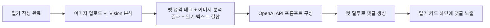
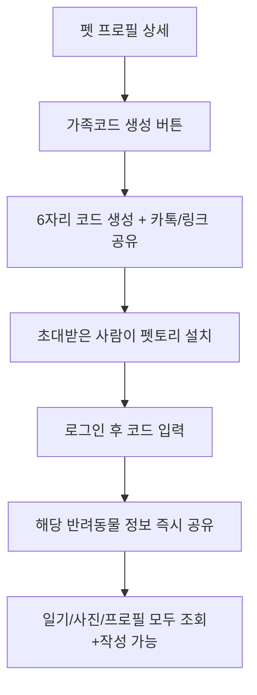
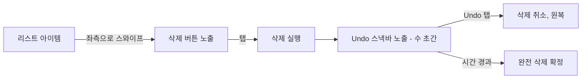

# 펫토리(Pettory) 서비스 기획서 & 화면기획서

**버전**: v4.0
**작성 기준일**: 2026.07.07
**이전 버전 대비 변경 요약**: 마이페이지 상세 설계 신규 추가, "우리의 시간(타임라인)" 기능 신규 추가, 가족 관리 화면 위치를 마이페이지 → 펫 상세로 이동, 리스트 삭제 UX를 아이콘 클릭 → 스와이프 방식으로 변경

---

## 버전 변경 이력

| 버전   | 변경 내용                                                                                                                                                                                                                                                                                                                                                                                                                                                                                                                                                                                                                                                                                                                                                                                      | 변경 목적                                                                                                                                                                         |
| ------ | ---------------------------------------------------------------------------------------------------------------------------------------------------------------------------------------------------------------------------------------------------------------------------------------------------------------------------------------------------------------------------------------------------------------------------------------------------------------------------------------------------------------------------------------------------------------------------------------------------------------------------------------------------------------------------------------------------------------------------------------------------------------------------------------------- | --------------------------------------------------------------------------------------------------------------------------------------------------------------------------------- |
| **v1** | **서비스 MVP 기획**<br>• AI 기반 반려동물 일기장 서비스 기획<br>• 회원가입 및 소셜 로그인<br>• 반려동물 등록 및 관리<br>• 사진 업로드 및 일기 작성<br>• AI 감성 일기 생성<br>• 반려동물 시점 AI 일기 생성<br>• 캘린더 기반 일기 조회                                                                                                                                                                                                                                                                                                                                                                                                                                                                                                                                                           | 반려동물과의 일상을 기록하고 AI가 감성적인 일기를 생성하는 기본 MVP 서비스 구축                                                                                                   |
| **v2** | **감성 아카이브 서비스로 확장**<br>• 멀티펫(Multi Pet) 지원<br>• 가족 공유 공간 및 댓글 기능 추가<br>• 이모지 반응 기능 추가<br>• 오늘의 한 컷 카드 생성 기능 추가<br>• 감정 타임라인 기능 추가<br>• 월간 PDF 추억북 자동 생성 기능 추가<br>• 화면기획서 및 사용자 플로우 전면 개편                                                                                                                                                                                                                                                                                                                                                                                                                                                                                                            | 단순 일기장을 넘어 가족이 함께 추억을 기록하고 회상할 수 있는 감성 아카이브 서비스로 확장                                                                                         |
| **v3** | **AI 반려동물 캐릭터 서비스로 고도화**<br>• AI 이미지 분석 기능 추가 (반려동물 종류, 행동, 분위기 분석)<br>• AI 성격 태그 자동 추론 기능 추가<br>• 이미지 + 일기 기반 '오늘의 반려동물 상태' 분석 기능 추가<br>• AI '오늘의 한마디' 생성 기능 추가<br>• AI 분석 구조 개선 (`normalized` + `display_tags` 분리)<br>• DB 구조 개선 (`pets.traits text[]`, `ai_analysis jsonb` 적용)<br>• 테이블 구조 및 인덱스 최적화                                                                                                                                                                                                                                                                                                                                                                            | AI가 단순히 일기를 작성하는 것을 넘어, 반려동물의 성격과 감정을 해석하고 사용자에게 전달하는 AI 캐릭터 기반 서비스로 발전                                                         |
| **v4** | **마이페이지 & 가족 구조 재설계**<br>• 마이페이지 상세 설계 신규 추가 (프로필 / 우리의 기록 / 알림 설정 / Premium / 데이터 관리 / 설정 / 고객센터 / 계정)<br>• '우리의 기록' 통계 메뉴 신규 추가 (일기·사진·AI댓글·카드·추억북·연속기록 수 시각화)<br>• '우리의 시간(Journey Timeline)' 기능 신규 추가 (첫 만남~1000일 마일스톤 자동 생성)<br>• 가족 관리 화면 위치 변경: 마이페이지 → 펫 상세 (User 기준 → **Pet 기준** 구조로 전환, 멀티펫 시 펫마다 독립된 가족 구성 가능)<br>• 가족 Owner/Member 권한 체계 명확화 (Owner는 가족 나가기 불가 등 세부 정책 확정)<br>• 펫 상세 탭 구성 확장: 갤러리/정보/요약(3개) → 갤러리/**감정 흐름**/정보/요약/**가족 관리**(5개)<br>• 리스트 삭제 UX 정책 변경: 아이콘 클릭 즉시 삭제 → **스와이프 삭제 + Undo 스낵바** (최초 1회 힌트 애니메이션 포함) | 계정 관리를 '설정'이 아닌 '집사의 공간'으로 재정의해 리텐션을 강화하고, 가족 관리 구조를 반려동물 중심으로 재설계해 멀티펫 확장성을 확보하며, 삭제 오탭 위험을 낮춰 사용성을 개선 |

---

## 1. 서비스 개요

### 1.1 한 줄 정의

반려동물과 나눈 오늘 하루를, 반려동물의 목소리로 되돌려받는 **AI 감성 다이어리 앱**

### 1.2 시장 내 차별점

| 구분        | 기존 반려동물 앱                | 펫토리                           |
| ----------- | ------------------------------- | -------------------------------- |
| 핵심 초점   | 건강 체크, 산책 기록, 병원 관리 | **추억 기록, 그날의 감정**       |
| 기록 방식   | 사료량/체중/접종일 등 수치 입력 | 사진 + 짧은 글로 하루 회상       |
| 상호작용    | 데이터 그래프 확인              | **AI가 펫이 되어 댓글로 대화**   |
| 감정적 가치 | 관리 도구                       | **정서적 동반자, 추억 아카이브** |

기존 앱들이 "펫을 잘 키우기 위한 관리 툴"이라면, 펫토리는 **"펫과 나눈 하루를 붙잡아두는 감성 기록 앱"**으로 포지셔닝합니다. 건강 데이터가 아니라 **감정과 순간**이 핵심 자산입니다.

### 1.3 핵심 가치 제안 (Value Proposition)

- 매일 남기는 짧은 기록이 나중엔 **"우리 아이와의 역사책"**이 된다
- 펫이 실제로 나에게 말을 거는 듯한 **정서적 몰입감**
- 가족(가족코드)과 함께 만들어가는 **공동의 추억 저장소**

---

## 2. 핵심 기능: AI 펫 댓글 시스템 (기존 MVP 핵심)

### 2.1 개념

사용자가 일기를 작성하면, OpenAI API가 아래 3가지 정보를 종합 분석하여 **펫의 성격에 맞는 말투로 댓글**을 답니다.

### 2.2 입력 데이터 구조

```
[분석 입력값]
1. 펫의 성격 태그       예) #활발 #애교 #호기심
2. 업로드 이미지 분석    예) 표정(신남/졸림/무표정), 배경 분위기(실내/야외/밝음/어두움)
3. 사용자가 작성한 일기 텍스트  예) "한강에서 1시간 산책! 새 친구도 만났다."
```

### 2.3 처리 흐름



### 2.4 출력 예시

| 성격 태그     | 상황                   | AI 댓글 예시                                                                 |
| ------------- | ---------------------- | ---------------------------------------------------------------------------- |
| #활발 #호기심 | 산책 중 새 친구를 만남 | "오늘 새 친구 냄새 진짜 좋았어! 또 만나고 싶다 킁킁 🐾"                      |
| #도도 #느긋   | 오후 내내 낮잠         | "햇볕이 너무 따뜻해서 눈을 뜰 수가 없었어. 세상에서 제일 편안한 낮잠이었어." |
| #애교         | 주인이 늦게 귀가       | "오늘따라 왜 이렇게 늦게 왔어... 그래도 왔으니까 용서해줄게, 안아줘!"        |

### 2.5 UI/UX 고려사항

- 댓글은 **말풍선 + 발바닥 아이콘**으로 시각적으로 "이건 AI가 아니라 우리 아이가 말하는 것"이라는 느낌을 강화 (기존 다이어리 화면의 하이라이트 박스 UI를 그대로 활용하면 좋음)
- 댓글 생성 중에는 로딩 문구도 감성적으로: `"몽이가 일기를 읽고 있어요..."` (일반적인 "로딩 중..." 대신)
- 댓글은 **수정 불가, 재생성(다시 듣기)은 1일 1회 제한** → AI 호출 비용 관리 + "그날의 반응"이라는 희소성 유지

---

## 3. 신규 기능 명세

아래 기능은 우선순위/개발 난이도를 고려해 **Phase로 구분**하는 것을 추천합니다.

| Phase                     | 포함 기능                                                               | 이유                                            |
| ------------------------- | ----------------------------------------------------------------------- | ----------------------------------------------- |
| **Phase 1 (필수 MVP)**    | 스플래시/온보딩, 회원가입·소셜로그인, 가족 관리, **마이페이지**         | 서비스 진입/기본 골격 없이는 출시 불가          |
| **Phase 2 (핵심 차별화)** | 가족 반응 기능, SNS 공유 카드, 추억 리마인드, **우리의 시간(타임라인)** | 바이럴 + 리텐션 직결                            |
| **Phase 3 (고도화)**      | 추억북, 주간/월간 AI 요약                                               | 데이터가 어느 정도 쌓인 후에 가치가 생기는 기능 |

---

### 3.1 [Phase 1] 스플래시 화면 & 온보딩

**목적**: 첫인상에서 앱의 감성적 톤을 각인시키고, 핵심 차별점(건강관리 X, 추억기록 O)을 3컷 안에 전달

**구성**

1. **스플래시**: 로고 + 발바닥 애니메이션 (1.5초 노출 후 자동 전환)
2. **온보딩 스와이프 (3컷)**
   - 1컷: "매일의 순간을, 잊지 마세요" — 사진+일기 작성 화면 예시
   - 2컷: "우리 아이가 답장을 보내요" — AI 댓글 달리는 모습 (핵심 차별점 강조)
   - 3컷: "가족과 함께 채워가는 추억" — 가족코드 공유 화면 예시
3. 마지막 컷에 "시작하기" CTA 버튼, 상단에 "건너뛰기" 텍스트 링크

**화면 기획**

```
┌─────────────────────────┐
│  ○ ● ●          [건너뛰기] │  ← 인디케이터 + 스킵
│                          │
│      [일러스트/스크린샷]   │
│                          │
│   우리 아이가 답장을      │
│      보내요 🐾           │
│                          │
│  일기를 쓰면, 몽이만의     │
│  말투로 답장이 와요        │
│                          │
│     [다음 >]              │
└─────────────────────────┘
```

---

### 3.2 [Phase 1] 회원가입 / 소셜로그인

**구성 요소**

- 소셜 로그인: 카카오(1순위), 애플(iOS 필수), 구글
- 카카오 우선 배치 이유: 국내 반려동물 커뮤니티 사용자층과의 접점이 큼, 가족코드 공유 시 카카오톡 공유 연동과 자연스럽게 이어짐
- 애플 로그인은 App Store 심사 정책상 소셜 로그인 제공 시 **필수 포함**

**화면 기획**

```
┌─────────────────────────┐
│                          │
│      [펫토리 로고]         │
│  "오늘의 우리, 기록해요"    │
│                          │
│  ┌────────────────────┐ │
│  │ 🟡  카카오로 시작하기  │ │
│  └────────────────────┘ │
│  ┌────────────────────┐ │
│  │ 🍎  Apple로 시작하기  │ │
│  └────────────────────┘ │
│  ┌────────────────────┐ │
│  │ 🔵  Google로 시작하기 │ │
│  └────────────────────┘ │
│                          │
│   이메일로 계속하기 (텍스트)│
└─────────────────────────┘
```

**분기 처리**

- 최초 로그인 시 → 반려동물 등록 화면(기존 화면)으로 자연 연결
- 기존 유저 로그인 시 → 홈 화면으로 바로 진입
- **가족코드로 초대받아 들어온 경우** → 로그인 후 "코드 입력" 화면을 자동으로 띄움 (v4부터 가족 관리 위치가 변경되었으므로 3.11 참고)

---

### 3.3 [Phase 1] 가족코드 공유 기능

> ⚠️ **v4 업데이트 안내**: 가족 관리 화면의 위치가 **마이페이지 → 펫 상세**로 변경되었습니다. 아래는 v1 기준 최초 설계 내용이며, **최신 사양(권한 정책, 화면 구성, 위치 변경 이유)은 3.11 [가족 관리]를 참고**해주세요. 이 섹션은 변경 배경을 이해하기 위한 참고용으로 남겨둡니다.

**목적**: 배우자, 가족 등 여러 명이 같은 반려동물의 기록을 함께 보고 쓸 수 있도록 함

**핵심 플로우 (v1 기준)**



**권한 설계 (v1 기준 — v4에서 Owner/Member로 명칭 정리됨, 3.11 참고)**

- 코드를 발급한 사람 = **오너(주 보호자)**: 가족코드 재발급/삭제, 펫 프로필 삭제 권한 보유
- 코드로 참여한 사람 = **가족 구성원**: 일기 작성/조회, 사진 업로드, 댓글/반응 가능하나 **펫 삭제는 불가**

---

### 3.4 [Phase 2] 가족 반응 기능

**목적**: 가족코드로 연결된 구성원들끼리 서로의 기록에 정서적으로 반응하며 "함께 키운다"는 느낌 강화

**기능 상세**

- 일기/사진에 **이모지 반응** (하트, 웃음, 놀람 등 4~5종으로 제한 → 커뮤니티 앱처럼 과해지지 않게)
- 짧은 댓글 작성 가능 (AI 댓글과 시각적으로 구분되도록 디자인 — 예: 가족 댓글은 일반 말풍선, AI 댓글은 발바닥 말풍선)
- 새 반응/댓글 발생 시 **푸시 알림** ("김민수님이 몽이의 오늘 일기에 반응을 남겼어요")

**화면 기획 (다이어리 상세 화면 하단 확장)**

```
┌─────────────────────────┐
│  2026.07.06   몽이         │
│  한강에서 1시간 산책!        │
│  [사진]                   │
│                          │
│  🐾 "오늘 새 친구 냄새       │
│     진짜 좋았어!" (AI)      │
│                          │
│  ────────────────────    │
│  ❤️ 😆 😮 🥹  [반응 추가]  │
│                          │
│  👤 김민수: 진짜 신났나보다ㅋㅋ│
│  [댓글 입력...]            │
└─────────────────────────┘
```

---

### 3.5 [Phase 2] SNS/카카오톡 공유 카드

**목적**: 바이럴 확산 + 앱 밖에서도 "예쁜 결과물"을 남기고 싶은 욕구 충족

**공유 카드 구성 요소**

- 업로드한 사진 (배경)
- 하단에 반투명 오버레이로 날짜 + 펫 이름
- 일기 요약 1줄 (전체 텍스트가 길면 AI가 요약)
- AI 댓글 1줄 (말풍선 스타일로 삽입)
- 하단에 작게 "Pettory" 워터마크/로고 → 자연스러운 앱 홍보

**화면 기획 - 공유 미리보기**

```
┌─────────────────────────┐
│   [공유 카드 미리보기]      │
│  ┌────────────────────┐ │
│  │   [업로드한 사진]      │ │
│  │                     │ │
│  │  🐾"오늘 새 친구 냄새   │ │
│  │   진짜 좋았어!"        │ │
│  │                     │ │
│  │  2026.07.06 · 몽이    │ │
│  │           🐾 Pettory │ │
│  └────────────────────┘ │
│                          │
│  [카카오톡]  [인스타 스토리] │
│  [이미지 저장]              │
└─────────────────────────┘
```

**UX 포인트**

- 공유 카드는 정사각형(인스타)과 세로형(카톡/스토리) 2가지 비율 자동 생성
- 저장 시 이미지 해상도는 SNS 업로드 기준 최적화 (1080x1080 등)

---

### 3.6 [Phase 2] 추억 리마인드

**목적**: 과거 기록을 다시 꺼내보게 해서 **재방문(리텐션)**을 유도

**트리거 조건**

- "N년 전 오늘" — 정확히 1년, 2년 전 같은 날짜에 작성한 일기가 있을 경우
- "작년 생일날" — 등록된 펫 생일과 매칭
- "함께한 지 O일" 마일스톤 — 100일, 365일, 500일 등 특정 숫자에 도달 시

**노출 위치**

- 홈 화면 상단에 카드 형태로 노출 (오늘의 카드 만들기 위 또는 아래)
- 푸시 알림으로도 발송: `"1년 전 오늘, 몽이는 이런 하루를 보냈어요 🐾"`

> 💡 **v4 연계**: 이 기능은 3.10 [우리의 시간(Journey Timeline)]과 데이터를 공유합니다. 추억 리마인드는 "오늘 갑자기 툭 던져지는 회상"이고, 우리의 시간은 "내가 원할 때 쭉 훑어보는 회상 아카이브"로 역할을 나눠 설계합니다.

**화면 기획 (홈 화면 삽입)**

```
┌─────────────────────────┐
│  안녕, 보호자님 👋           │
│  [펫 아바타 목록]            │
│                          │
│  ✨ 1년 전 오늘             │
│  ┌────────────────────┐ │
│  │ [작년 사진 썸네일]      │ │
│  │ "한강에서 처음 만난 날"  │ │
│  └────────────────────┘ │
│                          │
│  오늘의 한 컷               │
│  [+ 카드 만들기]            │
└─────────────────────────┘
```

---

### 3.7 [Phase 3] 추억북

**목적**: 일정 기간이 쌓이면 AI가 자동으로 "그동안의 이야기"를 정리해주는 결과물 제공 → 앱의 최종 만족감을 극대화하는 킬러 기능

**생성 주기**: 1개월 / 3개월 / 6개월 / 1년 단위 자동 생성 (사용자가 원할 시 수동 생성도 가능)

**추억북 구성**

1. **AI 요약 문구**: 해당 기간 펫의 상태를 종합 서술 (예: "이번 여름, 몽이는 유난히 산책을 좋아했어요. 특히 7월엔 새로운 친구를 3번이나 만났답니다.")
2. **감정 그래프/키워드**: 기간 동안 일기에서 자주 등장한 감정 키워드 시각화 (예: #신남 12회, #낮잠 8회)
3. **사진 모아보기**: 해당 기간 업로드 사진을 그리드로 자동 배치
4. **하이라이트 일기 3~5개**: AI가 판단한 가장 인상적인 순간 자동 선별

**화면 기획 - 추억북 목록**

```
┌─────────────────────────┐
│  < 몽이의 추억북            │
│                          │
│  ┌────────────────────┐ │
│  │ [커버 이미지]          │ │
│  │ 2026년 여름 이야기      │ │
│  │ 6.1 - 6.30           │ │
│  └────────────────────┘ │
│  ┌────────────────────┐ │
│  │ [커버 이미지]          │ │
│  │ 함께한 지 1년           │ │
│  │ 2025.7 - 2026.7      │ │
│  └────────────────────┘ │
└─────────────────────────┘
```

**화면 기획 - 추억북 상세 (매거진 형태)**

```
┌─────────────────────────┐
│  < 2026년 여름 이야기       │
│                          │
│  "이번 여름, 몽이는 유난히   │
│   산책을 좋아했어요..."      │
│                          │
│  자주 등장한 순간            │
│  #신남 12  #낮잠 8  #간식 5 │
│                          │
│  [사진 그리드 3x3]          │
│                          │
│  ⭐ 하이라이트                │
│  ┌────────────────────┐ │
│  │ 7/6 한강에서 새 친구    │ │
│  └────────────────────┘ │
│                          │
│  [PDF로 저장] [공유하기]     │
└─────────────────────────┘
```

**UX 포인트**

- 추억북은 완성 시 푸시 알림으로 "짜잔! 몽이의 여름 이야기가 도착했어요" 식으로 이벤트감 부여
- 유료화 포인트로 고려 가능 (예: 월간 추억북은 무료, PDF 인쇄용 고화질 저장은 유료)

---

### 3.8 [Phase 3] 주간/월간 AI 요약

**목적**: 추억북(장기)보다 짧은 주기로 "요즘 우리 아이 어때?"에 대한 스냅샷 제공

**생성 조건**

- 기본: 매주 요약
- 예외: 해당 주 일기가 2개 이하일 경우 → 자동으로 월간 요약으로 전환 (콘텐츠 부족한 요약 방지)

**노출 위치**: 펫 프로필 상세 화면 내 **"요약" 탭** (v4 기준 갤러리/감정 흐름/정보/요약/가족 관리 5개 탭 중 하나 — 3.11 IA 참고)

**요약 내용 구성**

- 이번 주(달) 한 줄 총평: "이번 주 몽이는 산책을 자주 나가서 컨디션이 좋아 보였어요"
- 감정 태그 빈도 (간단한 바 그래프)
- 사진 하이라이트 1~2장

**화면 기획 (펫 상세 화면 탭 추가)**

```
┌─────────────────────────┐
│  < 몽이                    │
│  [프로필 이미지/정보]        │
│                          │
│  갤러리|감정흐름|정보|요약|가족│
│  ───────────────────    │
│                          │
│  이번 주 몽이 이야기          │
│  "산책을 자주 나가서          │
│   컨디션이 좋아보였어요"       │
│                          │
│  감정 분포                  │
│  신남    ████████ 6      │
│  느긋    ████ 3           │
│  애교    ██ 2             │
│                          │
│  [하이라이트 사진]           │
└─────────────────────────┘
```

---

### 3.9 [Phase 1] 마이페이지 (My Page) ⭐ 신규

#### 목적

마이페이지는 단순한 설정 화면이 아니라, 사용자가 반려동물과 함께한 시간을 돌아보고 계정과 서비스를 관리하는 공간입니다. **'설정' 중심이 아닌 '집사의 프로필(Home of Caregiver)'**이라는 컨셉으로 설계합니다.

#### 핵심 UX 목표

- 내가 지금까지 남긴 추억을 한눈에 확인한다
- 계정 및 앱 설정을 관리한다
- 감성적인 리텐션 요소를 제공한다
- 서비스 이용 현황을 자연스럽게 확인한다

#### 화면 기획 - 전체 구성

```
┌─────────────────────────┐
│  😊 민슌                    │
│  몽이와 함께한 482일          │
│  ━━━━━━━━━━━━━━━━━━     │
│  📈 우리의 기록              │
│  🔔 알림 설정                │
│  ⭐ Premium                │
│  📦 데이터 관리              │
│  ⚙️ 설정                   │
│  ❓ 고객센터                 │
│  ━━━━━━━━━━━━━━━━━━     │
│  로그아웃                   │
│  회원탈퇴                   │
└─────────────────────────┘
```

#### 메뉴 상세

**① 프로필**

- 집사 정보를 관리하는 영역
- 구성: 프로필 사진 / 닉네임 수정 / 소개글(선택)
- 소개글 예시: `"몽이 엄마입니다 🐶"`

**② 우리의 기록 ⭐⭐⭐⭐⭐ (서비스에서 가장 감성적인 메뉴 중 하나)**

사용자가 지금까지 남긴 추억을 시각적으로 보여주는 통계 영역입니다.

```
┌─────────────────────────┐
│  일기        182개         │
│  사진      1,493장         │
│  AI 댓글      182개         │
│  카드         145장         │
│  추억북         6권          │
│  연속 기록      28일          │
└─────────────────────────┘
```

**UX 목표**: 사용자가 "생각보다 정말 많은 추억이 쌓였네"라는 감정을 느끼도록 만드는 것이 핵심입니다. 단순 숫자 나열이 아니라, 방문할 때마다 늘어나는 숫자를 통해 **꾸준히 쓸수록 애착이 쌓이는 구조**로 설계합니다.

**③ 알림 설정**

| 알림 항목        |
| ---------------- |
| AI 추억 리마인드 |
| 가족 댓글        |
| 가족 반응        |
| 추억북 완성      |
| 생일 알림        |
| 함께한 날 알림   |
| 주간 요약        |
| 월간 요약        |

**④ Premium**

- 현재 구독 상태 표시
- 오늘 AI 생성 횟수 표시 (예: `Free · AI 생성 3/5회`)
- Premium 혜택 안내

**⑤ 데이터 관리**

- 추억북 다운로드 / 데이터 백업 / 데이터 내보내기 / 캐시 삭제

**⑥ 설정**

- 다크모드 / 언어 / 글꼴 크기 / 앱 버전

**⑦ 고객센터**

- 문의하기 / FAQ / 개인정보 처리방침 / 이용약관

**⑧ 계정**

- 로그아웃 / 회원탈퇴

#### UX 포인트

마이페이지는 **"설정"보다 "집사의 공간"**이라는 느낌을 줘야 합니다. 통계와 감성 요소를 적절히 배치하여, 서비스에 오래 머물수록 추억이 쌓이는 경험을 제공합니다.

---

### 3.10 [Phase 2] 우리의 시간 (Journey Timeline) ⭐ 신규

#### 목적

사용자가 반려동물과 함께한 시간을 타임라인 형태로 회상하도록 만드는, **서비스의 감성적 리텐션 요소**입니다.

#### 진입 경로

마이페이지 상단의 `"몽이와 함께한 482일"` 카드를 터치하면 진입합니다.


#### 화면 기획

```
┌─────────────────────────┐
│  🐶 몽이와 함께한 시간        │
│                          │
│  2025.03.14              │
│  ● 첫 만남                  │
│  │                       │
│  ● 첫 산책                  │
│  │                       │
│  ● 첫 생일                  │
│  │                       │
│  ● 100일                  │
│  │                       │
│  ● 365일                  │
│  │                       │
│  ● 500일                  │
│  │                       │
│  ● 오늘                    │
└─────────────────────────┘
```

#### 자동 생성 이벤트 목록

- 첫 만남
- 첫 산책
- 첫 여행
- 첫 생일
- 함께한 100일
- 함께한 365일
- 함께한 500일
- 함께한 1000일

이 이벤트들은 반려동물 등록 시 입력한 "함께한 날"과 일기 데이터를 기준으로 **자동 산출**됩니다 (수동 입력 불필요).

#### 향후 확장 (Phase 3 이후 고려)

AI가 각 이벤트에 짧은 추억 편지를 자동 생성하는 기능으로 확장 가능합니다.

> 예시: _"처음 우리를 만난 날, 아직도 기억하고 있어."_

#### UI/UX 고려사항

- 각 이벤트 노드를 탭하면 해당 날짜 전후의 실제 일기/사진으로 딥링크 이동
- 아직 도달하지 않은 마일스톤(예: 아직 500일이 안 된 경우)은 **회색 톤의 "예정" 상태**로 흐리게 표시해 다음 마일스톤에 대한 기대감을 유도
- 3.6 [추억 리마인드]와 데이터 소스를 공유하되, 역할은 구분: **추억 리마인드 = 오늘 갑자기 떠오르는 회상 / 우리의 시간 = 내가 원할 때 쭉 훑어보는 회상 아카이브**

---

### 3.11 [Phase 1] 가족 관리 (Family Management) ⭐ 신규 · 위치 변경

#### 위치 변경 사항

| 구분 | 기존 (v1)  | 변경 (v4)        |
| ---- | ---------- | ---------------- |
| 위치 | 마이페이지 | **펫 상세 화면** |

#### 변경 이유

가족은 **사용자(User) 기준이 아니라 반려동물(Pet) 기준으로 관리**하는 것이 자연스럽습니다. 멀티펫 환경에서도 확장성이 높습니다.

예시:

- **몽이 가족**: 엄마, 아빠
- **코코 가족**: 엄마, 동생

처럼 반려동물마다 서로 다른 가족 구성이 가능한 구조입니다. (이 부분이 v1 설계와의 핵심 차이입니다 — v1에서는 사용자 1명당 가족코드가 종속되어 있었다면, v4는 **펫 1마리당 가족 그룹이 독립적으로 존재**합니다)

#### 화면 기획

```
┌─────────────────────────┐
│  가족 관리                  │
│  ━━━━━━━━━━━━━━━━━━     │
│  현재 가족                  │
│  👩 민슌 (Owner)            │
│  👨 아빠                    │
│  👩 엄마                    │
│  ━━━━━━━━━━━━━━━━━━     │
│  초대 코드                  │
│  A3F92K          [복사]     │
│  [카카오톡 공유]  [링크 공유] │
│  ━━━━━━━━━━━━━━━━━━     │
│  권한 관리                  │
│  ━━━━━━━━━━━━━━━━━━     │
│  가족 나가기                 │
└─────────────────────────┘
```

#### 권한 정책

| 구분             | Owner                                                 | Member |
| ---------------- | ----------------------------------------------------- | ------ |
| 가족 초대        | ✅                                                    | ❌     |
| 초대 코드 재발급 | ✅                                                    | ❌     |
| 가족 내보내기    | ✅                                                    | ❌     |
| 권한 변경        | ✅                                                    | ❌     |
| 펫 삭제          | ✅                                                    | ❌     |
| 가족 나가기      | ❌ (Owner는 나갈 수 없음, 펫 삭제로만 가족 해체 가능) | —      |
| 일기 작성        | ✅                                                    | ✅     |
| 사진 업로드      | ✅                                                    | ✅     |
| 댓글 작성        | ✅                                                    | ✅     |
| 이모지 반응      | ✅                                                    | ✅     |
| 가족/펫 삭제     | ✅                                                    | ❌     |

> Owner가 "가족 나가기"를 할 수 없도록 막은 것은 의도된 정책입니다 — Owner가 이탈하면 가족 전체가 관리 주체를 잃게 되므로, Owner는 **펫 삭제(=가족 전체 해체)** 또는 **권한을 다른 Member에게 위임 후 나가기** 흐름만 허용하는 것을 권장합니다. (권한 위임 플로우는 상세 설계 시 추가 확정 필요)

#### UX 정책

초대 링크를 통해 앱 설치 시, 로그인 완료 후 **자동으로 가족코드 입력 화면으로 이동**합니다. (기존 v1 정책과 동일하게 유지)

---

## 4. 화면 구조 전체 IA (Information Architecture) — v4 업데이트

### 4.1 마이페이지 IA 변경

```
기존 (v1)                     변경 (v4)
마이페이지                      마이페이지
├ 계정관리                      ├ 프로필
└ 가족관리                      ├ 우리의 기록 ⭐
                               ├ 알림 설정
                               ├ Premium
                               ├ 데이터 관리
                               ├ 설정
                               ├ 고객센터
                               ├ 로그아웃
                               └ 회원탈퇴
```

### 4.2 펫 상세 IA 변경

```
기존 (v1)              변경 (v4)
펫 상세                 펫 상세
├ 갤러리                 ├ 갤러리
├ 정보                  ├ 감정 흐름
└ 요약                  ├ 정보
                        ├ 요약
                        └ 가족 관리 ⭐ (신규 이동)
```

### 4.3 전체 IA (v4 최종)

```
스플래시
 └─ 온보딩(3컷)
     └─ 로그인 (카카오/애플/구글)
         ├─ [신규] 반려동물 등록 → 가족코드 입력(선택) → 홈
         └─ [기존] 홈
             ├─ 홈
             │   ├─ 추억 리마인드 카드
             │   └─ 오늘의 한 컷 (일기 작성)
             │       └─ 작성 완료 → AI 댓글 생성 → 공유 카드 생성
             ├─ 다이어리
             │   ├─ 일기 상세 (가족 반응/댓글 포함)
             │   └─ 일기 작성
             ├─ 펫 프로필
             │   ├─ 펫 상세
             │   │   ├─ 갤러리 탭
             │   │   ├─ 요약 탭
             │   │   └─ 가족 관리 탭 ⭐ (v4: 마이페이지에서 이동)
             │   └─ 추억북 목록
             │       └─ 추억북 상세
             └─ 마이페이지 ⭐ (v4: 상세 설계 완료)
                 ├─ 프로필
                 ├─ 우리의 기록 ⭐
                 │   └─ 우리의 시간 (타임라인) ⭐ (신규, "함께한 N일" 카드 터치 시 진입)
                 ├─ 알림 설정
                 ├─ Premium
                 ├─ 데이터 관리
                 ├─ 설정
                 ├─ 고객센터
                 ├─ 로그아웃
                 └─ 회원탈퇴
```

> **참고**: v1에서 "마이페이지는 명시적 요구는 없었으나 로그인/가족코드 관리 위해 필요"하다고 제안드렸던 부분이, v4에서 정식으로 상세 설계가 확정되었습니다. 다만 가족 관리 기능만은 펫 기준 구조로 펫 상세로 재배치되었다는 점이 핵심 변경점입니다.

---

## 5. UX 정책 업데이트: 리스트 삭제 UX 변경 ⭐ 신규

### 5.1 변경 배경

기존 v1 UI 리뷰에서 **"삭제(휴지통) 아이콘이 리스트에 상시 노출되어 오탭 위험이 있다"**는 점이 지적된 바 있습니다. v4에서는 이를 반영하여 삭제 UX를 아래와 같이 변경합니다.

### 5.2 변경 내용

| 구분      | 기존 (v1)                       | 변경 (v4)                       |
| --------- | ------------------------------- | ------------------------------- |
| 삭제 진입 | 우측 상단 삭제 아이콘 상시 노출 | **스와이프하여 삭제 버튼 노출** |
| 실행 후   | 즉시 삭제 (되돌리기 없음)       | 삭제 후 **Undo 스낵바 제공**    |

### 5.3 플로우



### 5.4 UX 힌트 (최초 1회)

사용자가 스와이프 삭제 기능을 처음 접했을 때 자연스럽게 인지하도록, **최초 1회에 한해** 아래와 같은 마이크로 인터랙션을 제공합니다.

- 안내 문구: `← 밀어서 삭제`
- 리스트 아이템이 약 **8px 정도 살짝 이동했다가 원위치로 돌아오는** 애니메이션을 자동 재생하여, 설명 없이도 "이 카드는 밀 수 있다"는 것을 직관적으로 인지시킴

### 5.5 적용 범위

이 삭제 UX 정책은 **펫 프로필 목록, 가족 구성원 목록 등 삭제 가능한 모든 리스트형 UI에 공통 적용**하는 것을 권장합니다.

---

## 6. 개발 우선순위 요약

| 우선순위 | 기능                       | 비고                                                             |
| -------- | -------------------------- | ---------------------------------------------------------------- |
| 1        | 스플래시/온보딩, 로그인    | 앱 진입 골격                                                     |
| 2        | **마이페이지**             | v4 신규 — 계정 골격 + 리텐션 요소(우리의 기록) 동시 확보         |
| 3        | **가족 관리** (펫 상세 내) | 위치는 변경됐으나 기능 자체는 여전히 초기 필수                   |
| 4        | 가족 반응 기능             | 가족 관리 기반 기능이라 순서상 다음                              |
| 5        | 추억 리마인드              | 데이터 로직 간단, 리텐션 효과 즉시 발생                          |
| 6        | **우리의 시간(타임라인)**  | v4 신규 — 추억 리마인드와 데이터 공유, 개발 부담 상대적으로 낮음 |
| 7        | SNS 공유 카드              | 바이럴 목적, 이미지 렌더링 작업 필요                             |
| 8        | 주간/월간 AI 요약          | 일정 데이터 축적 후 가치 발생                                    |
| 9        | 추억북                     | 가장 복잡한 AI 로직 + 데이터 축적 필요, 최후순위                 |

---

## 7. 향후 고려사항 (참고용 메모)

- 추억북/주간 요약 등 AI 호출이 잦아지는 기능이 늘어나므로, **OpenAI API 비용 관리** 정책(사용자당 호출 제한, 캐싱 전략)을 개발 초기에 설계해두는 것을 권장
- 가족 구성원이 늘어날수록 **알림 과부하** 위험이 있으므로, 알림 설정(반응/댓글 알림 on-off)을 마이페이지에 미리 반영 (v4에서 알림 설정 메뉴로 구체화 완료)
- 추억북은 향후 유료 구독 모델(프리미엄)의 핵심 후보 기능으로 고려 가능
- **[v4 신규]** 마이페이지의 "우리의 기록" 통계(일기/사진/AI댓글/카드/추억북/연속기록 수)는 실시간 집계가 필요하므로, 초기 DB 설계 단계에서 **집계 테이블 또는 캐싱 전략**을 함께 고려할 것
- **[v4 신규]** 가족 관리가 펫 기준으로 바뀌면서, 한 사용자가 여러 반려동물의 서로 다른 가족 그룹에 동시에 속할 수 있는 구조가 됩니다. 이 경우 **알림/활동 피드에서 "어떤 펫의 가족 활동인지" 명확히 구분되는 UI**가 필요합니다
- **[v4 신규]** Owner의 권한 위임(다른 Member를 Owner로 승격) 플로우가 현재 명세에 없으므로, Owner 이탈 시나리오(계정 삭제, 앱 삭제 등)에 대한 예외 처리를 상세 설계 단계에서 확정 필요
